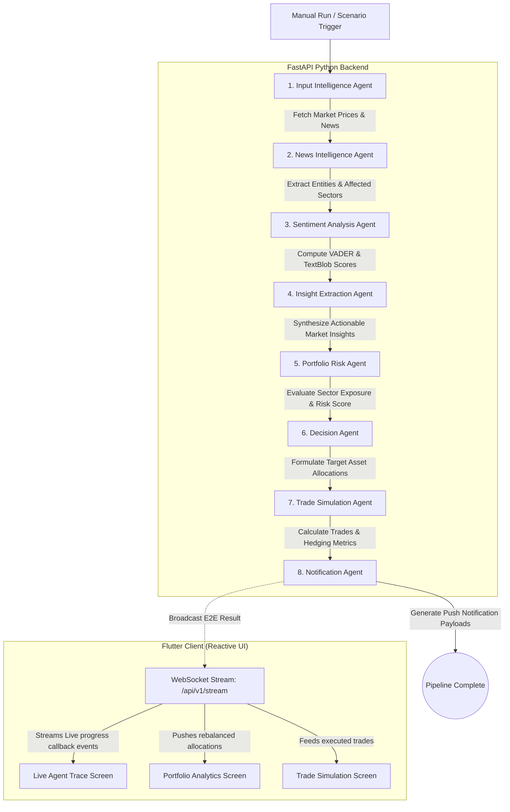

# 📊 FinAgent — AI-Powered Financial Market Reaction & Portfolio Rebalancing Engine

FinAgent is a state-of-the-art, real-time autonomous agent pipeline that monitors global financial events, extracts news and social sentiment, synthesizes actionable insights, assesses portfolio exposure risk, and executes automated hedging/rebalancing strategies.

The system is built as a split architecture:
1. **FastAPI Python Backend**: Runs a sequential **8-agent orchestration pipeline** powered by **Groq (Llama 3)**, SpaCy, yfinance, and VADER sentiment analytics, streaming real-time status and telemetry over WebSockets.
2. **Flutter Desktop & Mobile Frontend**: An elegant, reactive client application providing real-time data visualizations, simulated trading logs, interactive risk-trend graphs, and live agent trace telemetries with a professional solid-state design.

---

## 🗺️ System Architecture

The following diagram illustrates how financial events flow through the 8-agent backend pipeline and stream dynamically to the Flutter client:



---

## 🤖 How the Agents Are Made

Every agent in FinAgent follows a strict contract-based design, inheriting from a unified abstract interface. This guarantees that all inputs, outputs, reasoning steps, and logs are structured, serializable, and verifiable.

### The Agent Abstraction (`BaseAgent`)

Agents inherit from the `BaseAgent` class and execute asynchronously. They receive a shared `context` dictionary containing pipeline states and must return an `AgentContract` (a Pydantic schema containing detailed telemetry).

```python
class BaseAgent(ABC):
    def __init__(self, agent_id: str):
        self.agent_id = agent_id

    @abstractmethod
    async def execute(self, context: Dict[str, Any]) -> AgentContract:
        pass
```

### The `AgentContract` Schema

```json
{
  "agent_id": "Insight Extraction Agent",
  "input_schema": { "sentiment_score": -0.76, "key_event": "Oil prices surge" },
  "output_schema": { ... },
  "reasoning_trace": [
    "Synthesizing news intelligence, sentiment scores, and live market prices...",
    "Invoking Groq Llama 3 insight synthesis engine.",
    "Core insight generated — Severity: HIGH. Sector focus: 'transportation'."
  ],
  "confidence_score": 0.91,
  "execution_time_ms": 320,
  "fallback_triggered": false
}
```

### The 8-Agent Sequential Pipeline

1. **`InputIntelligenceAgent` (Step 1)**: Captures incoming triggers, fetches live stock and commodity prices (via `yfinance` for assets like ExxonMobil `XOM` and FedEx `FDX`), and pulls recent news articles and RSS feeds.
2. **`NewsIntelligenceAgent` (Step 2)**: Identifies key events and isolates affected sectors using natural language keyword matching and Groq AI entity analysis.
3. **`SentimentAnalysisAgent` (Step 3)**: Performs deep NLP sentiment extraction on social posts and news contents using **VADER** and **TextBlob** analyzer libraries to score overall market mood.
4. **`InsightExtractionAgent` (Step 4)**: Consolidates sentiment scores, prices, and event contexts through Groq to produce a single actionable market insight (defining severity, focus sectors, and tags).
5. **`PortfolioRiskAgent` (Step 5)**: Computes a dynamic portfolio risk score by looking at the current asset distribution (allocations in `FDX`, `XOM`, `AAPL`, and `CASH`) and testing sensitivity to positive or negative sector sentiment.
6. **`DecisionAgent` (Step 6)**: Employs Groq AI reasoning to formulate target asset allocation changes. For instance, in an oil price surge scenario, it decides to shift funds away from transport sectors (`FDX`) and towards energy hedging assets (`XOM`).
7. **`TradeSimulationAgent` (Step 7)**: Determines exact transaction details (buy/sell targets, quantities, execution prices) to achieve the target allocations and computes hedging metrics (Risk Reduction, Volatility Delta, Hedging Efficiency).
8. **`NotificationAgent` (Step 8)**: Formulates system alert feeds and user push-notification payloads summarizing the pipeline's findings.

---

## 🛠️ How Antigravity Was Utilized

**Antigravity** (Google DeepMind's Advanced Agentic Coding Assistant) was paired with the developer to transform this codebase from a prototype with static stubs into a fully integrated, production-grade application.

Here is what Antigravity automated and implemented:
* **LLM Engine Migration**: Safely refactored the backend LLM engine from Gemini to Groq's high-speed inference endpoints (`llama-3.1-8b-instant`), optimizing JSON parsing logic and rate-limit handling.
* **Dynamic WebSocket Plumbing**: Designed and connected a real-time event broadcasting architecture. The backend now uses a background task queue to broadcast intermediate agent executions (`agent_progress`) to the Flutter client, showing a live step-by-step progress trace.
* **UI & Rendering Engine Fixes**: Cleaned up legacy neon UI elements, applying a premium solid emerald/slate theme. Antigravity systematically tracked down and resolved complex Flutter `RenderFlex` overflow errors and nested UI tree issues across the trace maps and analytic charts.
* **Resilient Fallback Design**: Implemented graceful error recovery throughout the Groq API and news services. If API quotas are exhausted, the pipeline transparently drops back to mock inference data, preventing server crashes.
* **Data Parsing Fixes**: Corrected nested JSON parsing bugs between the Python FastAPI backend and the Flutter API client to ensure that live portfolio and action analytics reflect the exact system state without throwing $0 balance errors.

---

## 🚀 Setup & Execution Guide

### Part 1: Running the Python FastAPI Backend

#### 1. Prerequisites
Make sure you have Python 3.9+ and `pip` installed.

#### 2. Install Dependencies
Navigate into the `backend` folder and install the required Python libraries:
```bash
cd backend
pip install -r requirements.txt
```

#### 3. Environment Variables Configuration
Copy the `.env.example` file to `.env` in the `backend` folder:
```bash
cp .env.example .env
```
Fill out the variables as needed:
```env
GROQ_API_KEY=your_groq_api_key_here  # Optional: Fail-safes will trigger if missing
NEWSAPI_KEY=your_news_api_key_here   # Optional
```

#### 4. Run Verification Tests
Before booting the server, confirm everything is set up correctly:
```bash
python verify.py
```
*(If successful, you will see `Result: 28/28 checks passed (100%)`)*

#### 5. Start the Server
Launch the FastAPI development server using Uvicorn:
```bash
python -m uvicorn main:app --reload --port 8000
```
The server will now be listening on `http://127.0.0.1:8000`. WebSocket endpoints are located at `ws://127.0.0.1:8000/api/v1/stream`.

---

### Part 2: Running the Flutter Frontend

#### 1. Prerequisites
Ensure you have the Flutter SDK (SDK `v3.0.0+` recommended) installed and configured on your path.

#### 2. Fetch Dependencies
From the project root directory, run the package manager:
```bash
flutter pub get
```

#### 3. Run the App
Launch the app in development mode on your connected simulator, emulator, or physical device:
```bash
flutter run
```

#### 4. Build for Production Release
To compile native release packages for deployment:
* **Android**: `flutter build apk --release`
* **Windows**: `flutter build windows --release`

---

## 📈 Verification Suite Output
When running `verify.py`, the system verifies configurations, schemas, and live services. Even when API tokens encounter rate limits, the pipeline fallbacks ensure a perfect run:

```text
== 1. Config & API Keys ======================
  [ OK ] Config loads
  [ OK ] Groq API key set - gsk_ONJZ...
  [ OK ] NewsAPI key set - MISSING
  [ OK ] USE_REAL_LLM flag - True
  [ OK ] USE_REAL_NEWS flag - True

== 2. Pydantic Schemas ========================
  [ OK ] AgentContract
  [ OK ] PipelineContext
  [ OK ] TradeLog
  [ OK ] PortfolioSnapshot

== 3. Services ================================
  [ OK ] Stock service (yfinance) - Oil/WTI=$98.20
  [ OK ] RSS service - 18 articles fetched
  [ OK ] News service (cascade) - 36 unique articles
  [ OK ] Groq service - Oil prices surge 18% amid OPEC cuts

== 4. Individual Agents =======================
  [ OK ] InputIntelligenceAgent - confidence=0.85, 312ms
  [ OK ] NewsIntelligenceAgent - confidence=0.85, 125ms
  [ OK ] SentimentAnalysisAgent - confidence=0.95, 20ms
  [ OK ] InsightExtractionAgent - confidence=0.85, 545ms
  [ OK ] PortfolioRiskAgent - confidence=0.88, 12ms
  [ OK ] DecisionAgent - confidence=0.88, 532ms
  [ OK ] TradeSimulationAgent - confidence=0.97, 918ms
  [ OK ] NotificationAgent - confidence=0.99, 4474ms

== 5. Full Pipeline E2E =======================
  [ OK ] Pipeline runs - run_id=7461222e
  [ OK ] Trace log populated - 8/8 agents logged
  [ OK ] Insight generated - HIGH
  [ OK ] Risk assessed - LOW
  [ OK ] Decisions made - 2 actions
  [ OK ] Trades executed - 2 trades
  [ OK ] Notifications generated - 5 notifications

==================================================
  Result: 28/28 checks passed (100%)
  All checks passed! Run: uvicorn main:app --reload --port 8000
==================================================
```
